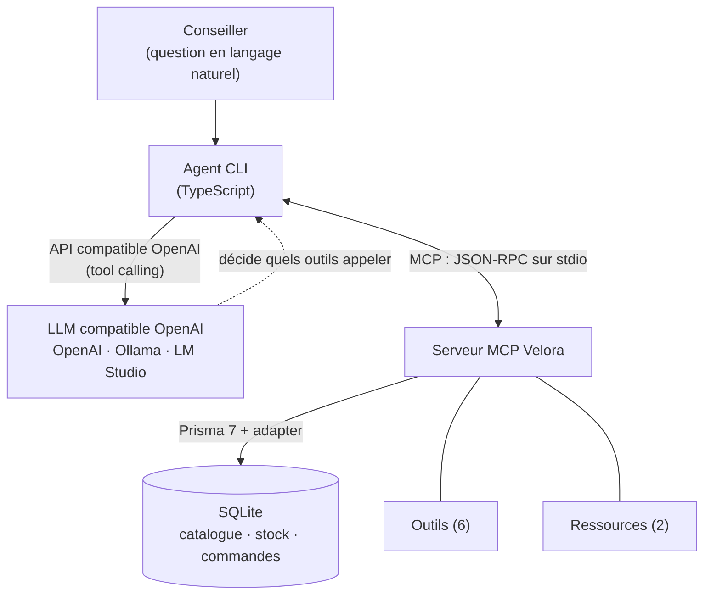

# 2. Démarche R&D et preuve de concept

## 2.1 Objectif du POC

Démontrer, sur le cas Velora, qu'un **serveur MCP** peut exposer les données
métier (catalogue, stock, commandes, politiques) et qu'un **agent IA** les
exploite pour répondre à un conseiller, le tout **testable sans clé payante**.

## 2.2 Architecture



Deux briques **découplées** :
1. **Serveur MCP** (`src/server.ts`), indépendant de tout LLM. Il expose des
   outils, des ressources et un prompt, et lit les données via Prisma/SQLite.
2. **Agent** (`src/agent/`), un **hôte MCP** qui se connecte au serveur,
   convertit les outils MCP en *functions* OpenAI (`bridge.ts`), puis exécute une
   **boucle tool-use** contre un endpoint **compatible OpenAI**.

## 2.3 Comment MCP fonctionne (le protocole en pratique)

MCP suit une architecture **client / serveur** à trois rôles :

- **Hôte (host)** : l'application qui pilote le LLM. Ici, notre **agent CLI**.
- **Client** : le connecteur intégré à l'hôte qui parle le protocole. Il y a
  **un client par serveur** connecté.
- **Serveur (server)** : le programme qui expose des capacités. Ici, le **serveur
  Velora**, qui publie 6 outils, 2 ressources et 1 prompt.

Les messages circulent en **JSON-RPC 2.0**, sur un **transport** au choix :
`stdio` (le serveur tourne en sous-processus local, notre cas) ou *Streamable
HTTP* (serveur distant). Le serveur ne « connaît » jamais le modèle : il répond à
des appels normalisés, quel que soit le client.

**Cycle de vie d'une session** (ce que fait l'agent à chaque lancement) :

1. `initialize` : poignée de main. Client et serveur échangent leur version de
   protocole et leurs *capabilities*.
2. `tools/list` : le client découvre les outils disponibles et leur schéma
   d'entrée (JSON Schema).
3. `tools/call` : le client exécute un outil avec des arguments validés et reçoit
   le résultat. De même, `resources/read` sert les données et `prompts/get` les
   gabarits.

**Trace concrète** d'un appel d'outil (simplifiée) :

```json
// requête  client -> serveur
{ "jsonrpc": "2.0", "id": 2, "method": "tools/call",
  "params": { "name": "get_order_status", "arguments": { "reference": "VEL-1003" } } }

// réponse  serveur -> client
{ "jsonrpc": "2.0", "id": 2, "result": {
  "content": [ { "type": "text", "text": "{ \"status\": \"preparing\", ... }" } ] } }
```

C'est cette indépendance (un serveur, des messages normalisés) qui rend le même
serveur consommable par **plusieurs clients** : notre agent, le **MCP Inspector**
ou **Claude Desktop**, sans une ligne de code à changer.

## 2.4 Les primitives exposées par le serveur Velora

MCP définit trois primitives. Notre serveur les utilise toutes :

- **Tools (outils)** : des actions appelables par le modèle, avec un schéma
  d'entrée validé. Velora en expose **6** (détaillés en 2.5).
- **Resources (ressources)** : des données en lecture, adressées par URI. Velora
  expose `policy://returns` et `policy://shipping` (politiques au format Markdown).
- **Prompts (gabarits)** : des modèles de message réutilisables. Velora expose
  `conseiller_reply`, un gabarit de réponse conseiller.

## 2.5 Les 6 outils en détail

Chaque outil est défini dans un fichier dédié (`src/tools/`), avec un **schéma
Zod** (typage + descriptions lues par le LLM) et une **annotation** de sûreté
(`readOnlyHint`). Cinq outils sont en **lecture seule** ; seul
`create_return_request` écrit, et uniquement sous condition.

| Outil | Entrée | Sortie | Type | Cas testé (cf. bloc « Preuves d'exécution ») |
|-------|--------|--------|------|----------------------------------------------|
| `search_products` | `query?`, `category?`, `color?`, `maxPriceEur?`, `inStockOnly?` | Liste de produits (SKU, prix, disponibilité, stock total) | Lecture | Robes en stock, 2 résultats |
| `get_product` | `sku` | Fiche complète + stock par taille | Lecture | VEL-CHAUS-001, stock par taille |
| `check_stock` | `sku`, `size?` | Disponibilité globale ou pour une taille | Lecture | VEL-CHAUS-001 taille 39, 3 en stock |
| `get_order_status` | `reference?` **ou** `email?` | Statut, articles et total d'une commande, ou liste des commandes d'un client | Lecture | VEL-1003 « En préparation » ; commandes d'Alice Martin |
| `get_return_policy` | `category?` | Politique de retours (Markdown) | Lecture | Renvoie la politique |
| `create_return_request` | `reference`, `sku`, `reason`, `size?` | RMA créé, **ou** erreur si la commande n'est pas livrée | **Écriture** | Refus sur VEL-1003 (non livrée), accepté sur VEL-1001 (livrée) |

**Garde-fou métier** : `create_return_request` vérifie que la commande est au
statut `delivered` avant d'écrire. Toute autre situation renvoie une erreur
explicite, sans rien modifier. C'est la traduction concrète du principe
*human-in-the-loop* (cf. 2.12).

## 2.6 Du serveur MCP à l'agent : le pont et la boucle tool-use

L'agent ne réimplémente pas les outils : il les **réutilise** via MCP. Le passage
du protocole MCP au format attendu par un LLM compatible OpenAI tient en deux
fonctions (`src/agent/bridge.ts`) :

1. **Conversion des outils** : la liste `tools/list` (MCP) est transformée en
   *functions* OpenAI. Le schéma d'entrée MCP (JSON Schema) devient directement le
   champ `parameters`. Aucune redéfinition manuelle.
2. **Normalisation des résultats** : le contenu renvoyé par un outil MCP est
   aplati en texte pour être réinjecté au modèle.

La **boucle** (`src/agent/agent.ts`) enchaîne alors :

1. On envoie au LLM la question du conseiller et la liste des outils.
2. Si le LLM demande un (ou plusieurs) appels d'outils, l'agent les exécute
   **réellement** via le client MCP et lui renvoie les résultats.
3. On répète jusqu'à une réponse finale (plafond `AGENT_MAX_STEPS`, défaut 6).

Un *system prompt* **anti-invention** impose au modèle de s'appuyer sur les outils
pour toute donnée factuelle (prix, stock, statut) et de ne jamais inventer.

## 2.7 Choix techniques

| Élément | Choix | Justification |
|---------|-------|---------------|
| Langage | TypeScript (Node 20+) | Cohérent avec la stack full-stack JS de Velora |
| Serveur MCP | `@modelcontextprotocol/sdk` (`McpServer`) | SDK officiel, API haut niveau, transport stdio |
| Validation | Zod | Schémas d'entrée typés + descriptions exposées au LLM |
| Données | **Prisma 7 + SQLite** (adapter better-sqlite3) | Réaliste, zéro serveur à installer, *seed* reproductible |
| Agent | SDK `openai` avec `baseURL` configurable | **Compatible OpenAI, Ollama, LM Studio...** via `.env` |
| Tests | Vitest | Intégration outils (sans LLM) + boucle agent (LLM simulé) |

## 2.8 Portabilité et test sans clé payante (note importante)

> L'agent utilise l'**API compatible OpenAI**. Il fonctionne donc avec :
> **OpenAI** (clé payante), **un modèle local** (Ollama / LM Studio, donc
> **gratuit et sans clé**), ou tout fournisseur compatible (Groq, Together,
> OpenRouter...). On change de fournisseur en modifiant **uniquement**
> `LLM_BASE_URL`, `LLM_API_KEY`, `LLM_MODEL` dans `.env`.
>
> Le **serveur MCP est indépendant du LLM** : il se teste **seul**, sans aucune
> clé, via `npm test` ou le *MCP Inspector*. Il est aussi consommable par
> **Claude Desktop** (configuration fournie), illustration concrète du
> « un serveur, plusieurs clients ».

Cette note figure aussi dans le `README.md` et le fichier `.env.example`.

## 2.9 Dépôt et installation

Dépôt : `https://github.com/Onitsag/velora-mcp-copilote`.
Guide complet d'installation **sans friction** dans le `README.md`. En résumé :

```bash
npm install
cp .env.example .env        # profil local Ollama par défaut
npm run db:setup            # crée la base SQLite + données fictives
npm run build
npm test                    # 12 tests, sans clé API
```

## 2.10 Cas d'usage testés en conditions réelles

Le fichier [`../demo/outils-demo.md`](../demo/outils-demo.md) (généré par
`npm run showcase`) contient des **appels réels** et leurs **résultats bruts**,
dont des cas limites probants :
- recherche filtrée (robes en stock), fiche produit avec **stock par taille** ;
- statut d'une commande connue (`VEL-1003`, « En préparation », articles + total) ;
- **garde-fou** : `create_return_request` **refuse** une commande non livrée
  (`VEL-1003`) et **accepte** une commande livrée (`VEL-1001`).

Côté agent, `npm run demo` (avec un LLM configuré) produit des transcripts dans
`docs/demo/transcripts/`. La **boucle tool-use** est par ailleurs validée
**sans clé** par `tests/agent.test.ts` (LLM déterministe simulé) : l'agent appelle
réellement `get_order_status` puis fonde sa réponse sur le résultat.

## 2.11 Tests et qualité

`npm test` exécute **12 tests** (3 fichiers) :
- `tests/tools.test.ts`, intégration des 6 outils via un **vrai client MCP**
  (sous-processus serveur), incluant les cas d'erreur et le garde-fou de retour ;
- `tests/bridge.test.ts`, normalisation des résultats MCP vers texte ;
- `tests/agent.test.ts`, boucle tool-use de l'agent avec LLM simulé.

`pretest` régénère la base et compile, garantissant des tests **déterministes**.

## 2.12 Sécurité (mesures du POC)

- Outils **en lecture seule** par défaut (`readOnlyHint`) ; seule écriture :
  `create_return_request`, **restreinte aux commandes livrées**, avec mention
  explicite *human-in-the-loop*.
- *System prompt* **anti-invention** (le modèle doit s'appuyer sur les outils).
- **Schémas d'entrée plats et validés** (Zod), donc compatibilité large et moindre
  surface d'attaque.
- Logs serveur sur **stderr** uniquement (stdout réservé au protocole).

## 2.13 Limites assumées du POC

Données **fictives** ; recherche **lexicale simple** (pas de recherche
vectorielle) ; pas d'authentification ni de multi-tenant ; transport **stdio**
local (pas d'exposition HTTP distante). Ces points sont des pistes
d'industrialisation, hors périmètre d'un POC.
