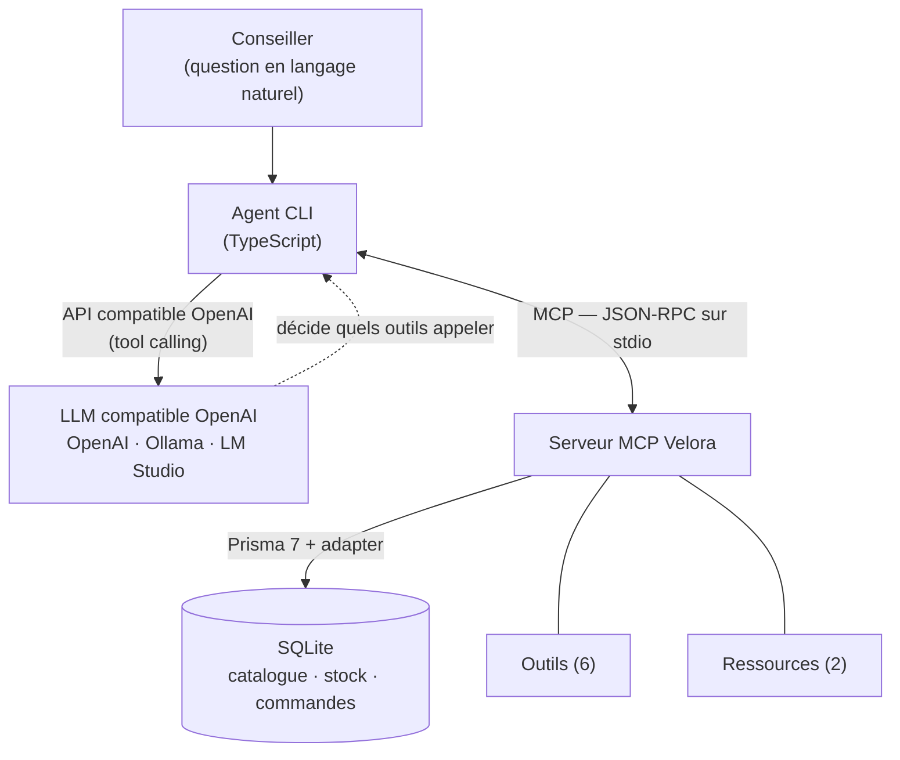

# 2. Démarche R&D et preuve de concept

## 2.1 Objectif du POC

Démontrer, sur le cas Velora, qu'un **serveur MCP** peut exposer les données
métier (catalogue, stock, commandes, politiques) et qu'un **agent IA** les
exploite pour répondre à un conseiller — le tout **testable sans clé payante**.

## 2.2 Architecture



Deux briques **découplées** :
1. **Serveur MCP** (`src/server.ts`) — indépendant de tout LLM. Expose outils,
   ressources et un prompt ; lit les données via Prisma/SQLite.
2. **Agent** (`src/agent/`) — un **hôte MCP** qui : se connecte au serveur,
   convertit les outils MCP en *functions* OpenAI (`bridge.ts`), puis exécute une
   **boucle *tool-use*** contre un endpoint **compatible OpenAI**.

## 2.3 Choix techniques

| Élément | Choix | Justification |
|--------|-------|---------------|
| Langage | TypeScript (Node 20+) | Cohérent avec la stack full-stack JS de Velora |
| Serveur MCP | `@modelcontextprotocol/sdk` (`McpServer`) | SDK officiel, API haut niveau, transport stdio |
| Validation | Zod | Schémas d'entrée typés + descriptions exposées au LLM |
| Données | **Prisma 7 + SQLite** (adapter better-sqlite3) | Réaliste, zéro serveur à installer, *seed* reproductible |
| Agent | SDK `openai` avec `baseURL` configurable | **Compatible OpenAI, Ollama, LM Studio…** via `.env` |
| Tests | Vitest | Intégration outils (sans LLM) + boucle agent (LLM simulé) |

## 2.4 Portabilité & test **sans clé payante** (note importante)

> L'agent utilise l'**API compatible OpenAI**. Il fonctionne donc avec :
> **OpenAI** (clé payante), **un modèle local** (Ollama / LM Studio → **gratuit,
> sans clé**), ou tout fournisseur compatible (Groq, Together, OpenRouter…).
> On change de fournisseur en modifiant **uniquement** `LLM_BASE_URL`,
> `LLM_API_KEY`, `LLM_MODEL` dans `.env`.
>
> Le **serveur MCP est indépendant du LLM** : il se teste **seul**, sans aucune
> clé, via `npm test` ou le *MCP Inspector*. Il est aussi consommable par
> **Claude Desktop** (configuration fournie) — illustration concrète du
> « un serveur, plusieurs clients ».

Cette note figure aussi dans le `README.md` et le fichier `.env.example`.

## 2.5 Outils et ressources exposés

**Outils** (6) — voir résultats réels dans [`../demo/outils-demo.md`](../demo/outils-demo.md) :
`search_products`, `get_product`, `check_stock`, `get_order_status`,
`get_return_policy`, `create_return_request`.

**Ressources** (2) : `policy://returns`, `policy://shipping` (Markdown).
**Prompt** (1) : `conseiller_reply` (gabarit de réponse conseiller).

## 2.6 Dépôt et installation

Dépôt : `https://github.com/<votre-compte>/velora-mcp-copilote` *(à compléter)*.
Guide complet d'installation **sans friction** dans le `README.md`. En résumé :

```bash
npm install
cp .env.example .env        # profil local Ollama par défaut
npm run db:setup            # crée la base SQLite + données fictives
npm run build
npm test                    # 12 tests, sans clé API
```

## 2.7 Cas d'usage testés **en conditions réelles**

Le fichier [`../demo/outils-demo.md`](../demo/outils-demo.md) (généré par
`npm run showcase`) contient des **appels réels** et leurs **résultats bruts**,
dont des cas limites probants :
- recherche filtrée (robes en stock), fiche produit avec **stock par taille** ;
- statut d'une commande connue (`VEL-1003` → *En préparation*, articles + total) ;
- **garde-fou** : `create_return_request` **refuse** une commande non livrée
  (`VEL-1003`) et **accepte** une commande livrée (`VEL-1001`).

Côté agent, `npm run demo` (avec un LLM configuré) produit des transcripts dans
`docs/demo/transcripts/`. La **boucle tool-use** est par ailleurs validée
**sans clé** par `tests/agent.test.ts` (LLM déterministe simulé) : l'agent appelle
réellement `get_order_status` puis fonde sa réponse sur le résultat.

## 2.8 Tests & qualité

`npm test` exécute **12 tests** (3 fichiers) :
- `tests/tools.test.ts` — intégration des 6 outils via un **vrai client MCP**
  (sous-processus serveur), incluant les cas d'erreur et le garde-fou de retour ;
- `tests/bridge.test.ts` — normalisation des résultats MCP → texte ;
- `tests/agent.test.ts` — boucle *tool-use* de l'agent avec LLM simulé.

`pretest` régénère la base et compile, garantissant des tests **déterministes**.

## 2.9 Sécurité (mesures du POC)

- Outils **en lecture seule** par défaut (`readOnlyHint`) ; seule écriture :
  `create_return_request`, **restreinte aux commandes livrées**, avec mention
  explicite *human-in-the-loop*.
- *System prompt* **anti-invention** (le modèle doit s'appuyer sur les outils).
- **Schémas d'entrée plats et validés** (Zod) → compat large + moindre surface.
- Logs serveur sur **stderr** uniquement (stdout réservé au protocole).

## 2.10 Limites assumées du POC

Données **fictives** ; recherche **lexicale simple** (pas de recherche
vectorielle) ; pas d'authentification ni de multi-tenant ; transport **stdio**
local (pas d'exposition HTTP distante). Ces points sont des pistes d'industrialisation,
hors périmètre d'un POC.
