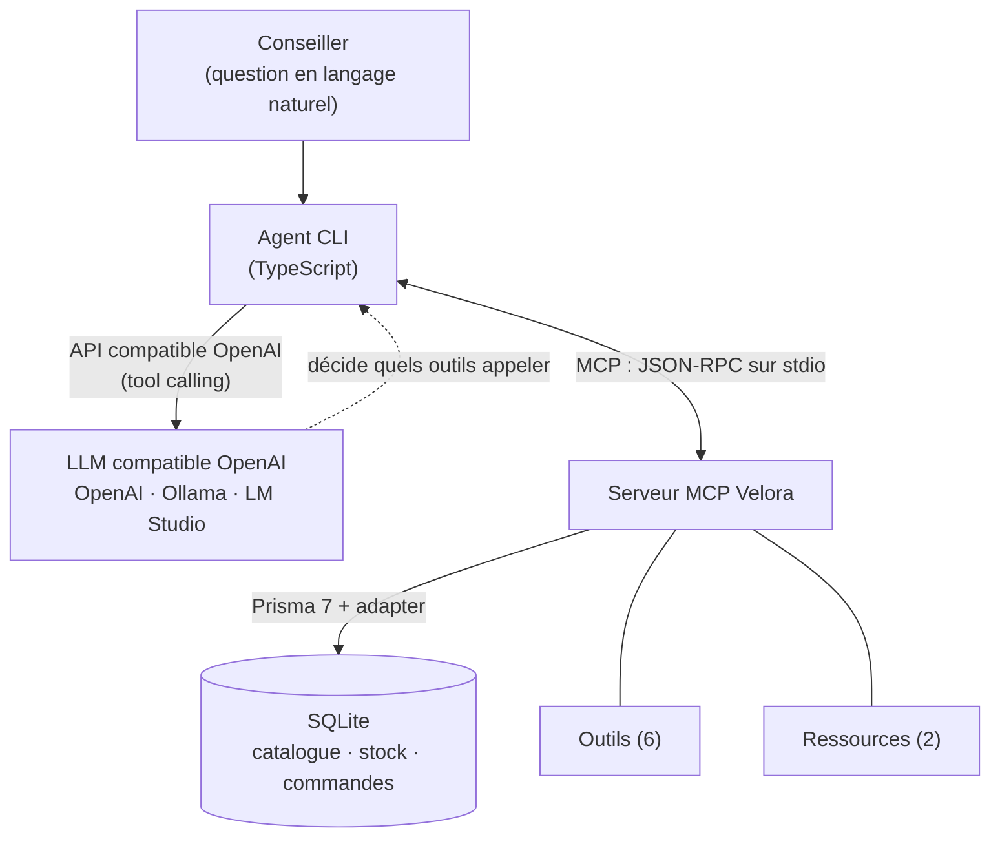

# Learning Lab M2DFS : MCP (Model Context Protocol)
## Étude d'adoption : copilote conseiller de Velora (e-commerce fictif)

**Rendu écrit** : rapport + POC (dépôt GitHub).
**POC** : serveur MCP (TypeScript) + agent compatible OpenAI (cloud ou local).

---

# 1. Note de cadrage stratégique

## 1.1 Contexte et entreprise

**Velora** est un pure-player e-commerce de mode et lifestyle (entreprise fictive
support de cette étude) : ~110 salariés, ~35 M€ de CA, un catalogue d'environ
**12 000 références** et une équipe de **~15 conseillers** au service client
(chat + e-mail).

**Problème observé.** Pour répondre à un client, un conseiller doit aujourd'hui
jongler entre plusieurs outils : back-office (stock, commandes), fiches produit,
documents de politique (retours, livraison). Conséquences : temps de réponse
élevé, réponses parfois incohérentes d'un conseiller à l'autre, et
**onboarding long** des nouvelles recrues.

**Besoin métier.** Un **copilote conseiller** : un assistant IA capable de
répondre en langage naturel en s'appuyant **uniquement** sur les données internes
(catalogue, stock, commandes, politiques), de façon **fiable et sourcée**, pour
réduire le temps de réponse et homogénéiser la qualité.

## 1.2 La technologie étudiée : MCP (Model Context Protocol)

MCP est un **standard ouvert** qui normalise la façon dont un modèle de langage
se connecte à des **outils** et des **données** externes. Image courante : le
« **port USB-C des applications d'IA** » : au lieu d'écrire une intégration
sur-mesure par modèle, on expose ses capacités **une seule fois** via un
**serveur MCP**, que n'importe quel client compatible peut consommer.

- **Origine & gouvernance** : introduit par Anthropic (fin 2024), il est
  désormais **gouverné de façon neutre** par l'*Agentic AI Foundation* (sous
  l'égide de la Linux Foundation, depuis décembre 2025).
- **Primitives** (3) : **Tools** (actions appelables), **Resources** (données en
  lecture), **Prompts** (gabarits réutilisables).
- **Transport** : `stdio` (serveur local) ou *Streamable HTTP* (serveur distant).
  Protocole **JSON-RPC**, révision **2025-11-25**.

## 1.3 Argumentaire décisionnel : gains attendus

| Axe | Gain apporté par MCP |
|-----|----------------------|
| **Maintenabilité** | Outils centralisés dans un serveur, schémas typés (Zod / JSON Schema). Une seule source de vérité, testable isolément. |
| **Réutilisabilité** | *Un* serveur, *plusieurs* clients : Claude Desktop, agent custom, IDE, futur agent vocal… sans réécriture. |
| **Découplage / pas de lock-in** | Le serveur est indépendant du modèle. On change de LLM (cloud ↔ local) sans toucher à l'intégration, comme démontré dans notre POC (bascule via `.env`). |
| **Sécurité / gouvernance** | Annotations d'outils (`readOnly`, `destructive`), périmètre d'accès maîtrisé, journalisation centralisable, *allow-list* via registre. |
| **Scalabilité (organisationnelle)** | Chaque équipe publie ses serveurs ; l'écosystème se compose au lieu de se dupliquer. |
| **Time-to-market** | SDK officiels (TS/Python), *MCP Inspector*, nombreux serveurs prêts à l'emploi. |

## 1.4 Analyse comparative de l'écosystème

**Maturité & communauté (chiffres, 2026).**
- Gouvernance neutre (Linux Foundation / Agentic AI Foundation).
- **Registre officiel** de serveurs MCP : ~**9 600** serveurs, ~29 000 versions.
- ~**15 900** dépôts GitHub avec le topic `mcp-server` ; dépôt de référence
  `modelcontextprotocol/servers` ~**86 k** étoiles.
- ~**97 M** de téléchargements/mois des SDK (Python + TypeScript).
- **Adoption transverse** : Anthropic, **OpenAI**, Google, Microsoft, AWS,
  Cloudflare, GitHub… ~**41 %** des organisations interrogées déclarent un usage
  en production (rapport Stacklok 2026).

> Lecture critique : MCP n'est plus une curiosité de 2024 mais un standard
> **multi-éditeurs** en adoption rapide, ce qui réduit le risque de pari
> technologique. Sa jeunesse (spec qui évolue vite) reste à surveiller.

**Comparaison des approches d'outillage d'un LLM.**

| Approche | Avantages | Inconvénients |
|----------|-----------|---------------|
| **Function calling « maison »** (format propre à chaque API) | Démarrage immédiat, zéro dépendance | Couplé au fournisseur, **non réutilisable**, à re-maintenir à chaque LLM |
| **Framework d'orchestration** (LangChain, LlamaIndex) | Riche, nombreux connecteurs | Abstractions lourdes, **lock-in framework**, montée en version coûteuse |
| **MCP** (notre choix) | **Standard ouvert**, réutilisable, **découplé du modèle**, outillage (Inspector, registre) | Jeune (spec mouvante), **sécurité à durcir** (cf. menaces) |

## 1.5 Matrice SWOT

| **Forces** | **Faiblesses** |
|------------|----------------|
| Standard ouvert, gouvernance neutre | Spécification jeune, encore en évolution rapide |
| Découplage modèle/données (pas de lock-in) | Outillage de debug/observabilité encore vert |
| Réutilisable par plusieurs clients | Courbe d'apprentissage côté développeurs |
| SDK officiels + Inspector + large écosystème | Qualité du *tool calling* variable selon les modèles (surtout locaux) |

| **Opportunités** | **Menaces** |
|------------------|-------------|
| Écosystème de serveurs réutilisables (registre) | **Sécurité** : injection de prompt, *tool poisoning* |
| Vers des agents multi-outils plus autonomes | *Confused deputy* / gestion des jetons OAuth |
| Standard adopté par les principaux éditeurs | Agents sur-privilégiés → surface d'attaque élargie |
| Mutualisation entre équipes internes | Dépendance à la trajectoire de la spec (versions) |

**Mitigations retenues pour le POC** : outils en lecture seule par défaut
(annotation `readOnlyHint`), unique action d'écriture restreinte (retour possible
uniquement sur commande livrée) avec mention *human-in-the-loop*, *system prompt*
anti-invention, schémas d'entrée plats et validés (Zod), journaux sur `stderr`.

## 1.6 Décision

Le POC (bloc 2) démontre la **viabilité technique** et la **valeur** de MCP pour
le copilote conseiller de Velora. **Recommandation : adoption**, sous conditions
de durcissement sécurité (revue des actions d'écriture, *allow-list* de serveurs,
journalisation) et de choix de modèle (cf. budget, bloc 3).


---

# 2. Démarche R&D et preuve de concept

## 2.1 Objectif du POC

Démontrer, sur le cas Velora, qu'un **serveur MCP** peut exposer les données
métier (catalogue, stock, commandes, politiques) et qu'un **agent IA** les
exploite pour répondre à un conseiller, le tout **testable sans clé payante**.

## 2.2 Architecture



Deux briques **découplées** :
1. **Serveur MCP** (`src/server.ts`), indépendant de tout LLM. Il expose des
   outils, des ressources et un prompt, et lit les données via Prisma/SQLite.
2. **Agent** (`src/agent/`), un **hôte MCP** qui se connecte au serveur,
   convertit les outils MCP en *functions* OpenAI (`bridge.ts`), puis exécute une
   **boucle tool-use** contre un endpoint **compatible OpenAI**.

## 2.3 Comment MCP fonctionne (le protocole en pratique)

MCP suit une architecture **client / serveur** à trois rôles :

- **Hôte (host)** : l'application qui pilote le LLM. Ici, notre **agent CLI**.
- **Client** : le connecteur intégré à l'hôte qui parle le protocole. Il y a
  **un client par serveur** connecté.
- **Serveur (server)** : le programme qui expose des capacités. Ici, le **serveur
  Velora**, qui publie 6 outils, 2 ressources et 1 prompt.

Les messages circulent en **JSON-RPC 2.0**, sur un **transport** au choix :
`stdio` (le serveur tourne en sous-processus local, notre cas) ou *Streamable
HTTP* (serveur distant). Le serveur ne « connaît » jamais le modèle : il répond à
des appels normalisés, quel que soit le client.

**Cycle de vie d'une session** (ce que fait l'agent à chaque lancement) :

1. `initialize` : poignée de main. Client et serveur échangent leur version de
   protocole et leurs *capabilities*.
2. `tools/list` : le client découvre les outils disponibles et leur schéma
   d'entrée (JSON Schema).
3. `tools/call` : le client exécute un outil avec des arguments validés et reçoit
   le résultat. De même, `resources/read` sert les données et `prompts/get` les
   gabarits.

**Trace concrète** d'un appel d'outil (simplifiée) :

```json
// requête  client -> serveur
{ "jsonrpc": "2.0", "id": 2, "method": "tools/call",
  "params": { "name": "get_order_status", "arguments": { "reference": "VEL-1003" } } }

// réponse  serveur -> client
{ "jsonrpc": "2.0", "id": 2, "result": {
  "content": [ { "type": "text", "text": "{ \"status\": \"preparing\", ... }" } ] } }
```

C'est cette indépendance (un serveur, des messages normalisés) qui rend le même
serveur consommable par **plusieurs clients** : notre agent, le **MCP Inspector**
ou **Claude Desktop**, sans une ligne de code à changer.

## 2.4 Les primitives exposées par le serveur Velora

MCP définit trois primitives. Notre serveur les utilise toutes :

- **Tools (outils)** : des actions appelables par le modèle, avec un schéma
  d'entrée validé. Velora en expose **6** (détaillés en 2.5).
- **Resources (ressources)** : des données en lecture, adressées par URI. Velora
  expose `policy://returns` et `policy://shipping` (politiques au format Markdown).
- **Prompts (gabarits)** : des modèles de message réutilisables. Velora expose
  `conseiller_reply`, un gabarit de réponse conseiller.

## 2.5 Les 6 outils en détail

Chaque outil est défini dans un fichier dédié (`src/tools/`), avec un **schéma
Zod** (typage + descriptions lues par le LLM) et une **annotation** de sûreté
(`readOnlyHint`). Cinq outils sont en **lecture seule** ; seul
`create_return_request` écrit, et uniquement sous condition.

| Outil | Entrée | Sortie | Type | Cas testé (cf. bloc « Preuves d'exécution ») |
|-------|--------|--------|------|----------------------------------------------|
| `search_products` | `query?`, `category?`, `color?`, `maxPriceEur?`, `inStockOnly?` | Liste de produits (SKU, prix, disponibilité, stock total) | Lecture | Robes en stock, 2 résultats |
| `get_product` | `sku` | Fiche complète + stock par taille | Lecture | VEL-CHAUS-001, stock par taille |
| `check_stock` | `sku`, `size?` | Disponibilité globale ou pour une taille | Lecture | VEL-CHAUS-001 taille 39, 3 en stock |
| `get_order_status` | `reference?` **ou** `email?` | Statut, articles et total d'une commande, ou liste des commandes d'un client | Lecture | VEL-1003 « En préparation » ; commandes d'Alice Martin |
| `get_return_policy` | `category?` | Politique de retours (Markdown) | Lecture | Renvoie la politique |
| `create_return_request` | `reference`, `sku`, `reason`, `size?` | RMA créé, **ou** erreur si la commande n'est pas livrée | **Écriture** | Refus sur VEL-1003 (non livrée), accepté sur VEL-1001 (livrée) |

**Garde-fou métier** : `create_return_request` vérifie que la commande est au
statut `delivered` avant d'écrire. Toute autre situation renvoie une erreur
explicite, sans rien modifier. C'est la traduction concrète du principe
*human-in-the-loop* (cf. 2.12).

Concrètement, un outil tient en un schéma Zod (validé et décrit pour le LLM), une
annotation de sûreté et un handler. Exemple (extrait de `src/tools/checkStock.ts`) :

```ts
server.registerTool(
  "check_stock",
  {
    title: "Vérifier le stock",
    description: "Vérifie la disponibilité d'un produit, globalement ou pour une taille.",
    inputSchema: {
      sku: z.string().describe("SKU exact du produit, ex: VEL-CHAUS-001"),
      size: z.string().optional().describe("Taille précise, ex: 39, M, TU"),
    },
    annotations: { readOnlyHint: true, openWorldHint: false }, // outil en lecture seule
  },
  async ({ sku, size }) => {
    const p = await findProductBySku(sku);
    if (!p) return errorResult(`Aucun produit trouvé pour le SKU "${sku}".`);
    // ... renvoie le stock (global, ou pour la taille demandée)
  },
);
```

## 2.6 Du serveur MCP à l'agent : le pont et la boucle tool-use

L'agent ne réimplémente pas les outils : il les **réutilise** via MCP. Le passage
du protocole MCP au format attendu par un LLM compatible OpenAI tient en deux
fonctions (`src/agent/bridge.ts`) :

1. **Conversion des outils** : la liste `tools/list` (MCP) est transformée en
   *functions* OpenAI. Le schéma d'entrée MCP (JSON Schema) devient directement le
   champ `parameters`. Aucune redéfinition manuelle.
2. **Normalisation des résultats** : le contenu renvoyé par un outil MCP est
   aplati en texte pour être réinjecté au modèle.

La **boucle** (`src/agent/agent.ts`) enchaîne alors :

1. On envoie au LLM la question du conseiller et la liste des outils.
2. Si le LLM demande un (ou plusieurs) appels d'outils, l'agent les exécute
   **réellement** via le client MCP et lui renvoie les résultats.
3. On répète jusqu'à une réponse finale (plafond `AGENT_MAX_STEPS`, défaut 6).

Un *system prompt* **anti-invention** impose au modèle de s'appuyer sur les outils
pour toute donnée factuelle (prix, stock, statut) et de ne jamais inventer.

Le cœur de la boucle (extrait de `src/agent/agent.ts`) :

```ts
for (let i = 0; i < maxSteps; i++) {
  const res = await llm.chat.completions.create({ model, messages, tools, tool_choice: "auto" });
  const msg = res.choices[0].message;
  messages.push(msg);

  // Aucun outil demandé : le modèle a sa réponse finale
  if (!msg.tool_calls?.length) return { answer: msg.content ?? "", steps };

  // Sinon, on exécute chaque outil via le client MCP, puis on renvoie le résultat au modèle
  for (const call of msg.tool_calls) {
    const result = await client.callTool({
      name: call.function.name,
      arguments: JSON.parse(call.function.arguments),
    });
    messages.push({ role: "tool", tool_call_id: call.id, content: mcpResultToText(result) });
  }
}
```

## 2.7 Choix techniques

| Élément | Choix | Justification |
|---------|-------|---------------|
| Langage | TypeScript (Node 20+) | Cohérent avec la stack full-stack JS de Velora |
| Serveur MCP | `@modelcontextprotocol/sdk` (`McpServer`) | SDK officiel, API haut niveau, transport stdio |
| Validation | Zod | Schémas d'entrée typés + descriptions exposées au LLM |
| Données | **Prisma 7 + SQLite** (adapter better-sqlite3) | Réaliste, zéro serveur à installer, *seed* reproductible |
| Agent | SDK `openai` avec `baseURL` configurable | **Compatible OpenAI, Ollama, LM Studio...** via `.env` |
| Tests | Vitest | Intégration outils (sans LLM) + boucle agent (LLM simulé) |

## 2.8 Portabilité et test sans clé payante (note importante)

> L'agent utilise l'**API compatible OpenAI**. Il fonctionne donc avec :
> **OpenAI** (clé payante), **un modèle local** (Ollama / LM Studio, donc
> **gratuit et sans clé**), ou tout fournisseur compatible (Groq, Together,
> OpenRouter...). On change de fournisseur en modifiant **uniquement**
> `LLM_BASE_URL`, `LLM_API_KEY`, `LLM_MODEL` dans `.env`.
>
> Le **serveur MCP est indépendant du LLM** : il se teste **seul**, sans aucune
> clé, via `npm test` ou le *MCP Inspector*. Il est aussi consommable par
> **Claude Desktop** (configuration fournie), illustration concrète du
> « un serveur, plusieurs clients ».

Cette note figure aussi dans le `README.md` et le fichier `.env.example`.

## 2.9 Dépôt et installation

Dépôt : `https://github.com/Onitsag/velora-mcp-copilote`.
Guide complet d'installation **sans friction** dans le `README.md`. En résumé :

```bash
npm install
cp .env.example .env        # profil local Ollama par défaut
npm run db:setup            # crée la base SQLite + données fictives
npm run build
npm test                    # 12 tests, sans clé API
```

## 2.10 Cas d'usage testés en conditions réelles

Le fichier [`../demo/outils-demo.md`](../demo/outils-demo.md) (généré par
`npm run showcase`) contient des **appels réels** et leurs **résultats bruts**,
dont des cas limites probants :
- recherche filtrée (robes en stock), fiche produit avec **stock par taille** ;
- statut d'une commande connue (`VEL-1003`, « En préparation », articles + total) ;
- **garde-fou** : `create_return_request` **refuse** une commande non livrée
  (`VEL-1003`) et **accepte** une commande livrée (`VEL-1001`).

Côté agent, `npm run demo` (avec un LLM configuré) produit des transcripts dans
`docs/demo/transcripts/`. La **boucle tool-use** est par ailleurs validée
**sans clé** par `tests/agent.test.ts` (LLM déterministe simulé) : l'agent appelle
réellement `get_order_status` puis fonde sa réponse sur le résultat.

## 2.11 Tests et qualité

`npm test` exécute **12 tests** (3 fichiers) :
- `tests/tools.test.ts`, intégration des 6 outils via un **vrai client MCP**
  (sous-processus serveur), incluant les cas d'erreur et le garde-fou de retour ;
- `tests/bridge.test.ts`, normalisation des résultats MCP vers texte ;
- `tests/agent.test.ts`, boucle tool-use de l'agent avec LLM simulé.

`pretest` régénère la base et compile, garantissant des tests **déterministes**.

## 2.12 Sécurité (mesures du POC)

- Outils **en lecture seule** par défaut (`readOnlyHint`) ; seule écriture :
  `create_return_request`, **restreinte aux commandes livrées**, avec mention
  explicite *human-in-the-loop*.
- *System prompt* **anti-invention** (le modèle doit s'appuyer sur les outils).
- **Schémas d'entrée plats et validés** (Zod), donc compatibilité large et moindre
  surface d'attaque.
- Logs serveur sur **stderr** uniquement (stdout réservé au protocole).

## 2.13 Limites assumées du POC

Données **fictives** ; recherche **lexicale simple** (pas de recherche
vectorielle) ; pas d'authentification ni de multi-tenant ; transport **stdio**
local (pas d'exposition HTTP distante). Ces points sont des pistes
d'industrialisation, hors périmètre d'un POC.


---

# 3. Étude budgétaire et d'adoption

> Tarifs éditeurs exprimés en USD ; parité ~1:1 € retenue pour simplifier la
> lecture. Volumes = hypothèses de travail pour Velora (~15 conseillers).

## 3.1 Hypothèse de volume

| Paramètre | Hypothèse |
|-----------|-----------|
| Conseillers | 15 |
| Requêtes copilote / conseiller / jour | ~30 |
| Jours ouvrés / mois | ~21 |
| **Total requêtes / mois** | **~10 000** |
| Tokens / requête (avec aller-retours d'outils) | ~3 000 entrée + ~500 sortie |
| **Volume mensuel** | **~30 M tokens entrée + ~5 M sortie** |

## 3.2 Coûts directs

### a) Inférence LLM (cœur du coût variable)

| Option | Prix (entrée / sortie, /M) | Coût mensuel estimé* |
|--------|----------------------------|----------------------|
| **OpenAI gpt-4o-mini** | 0,15 / 0,60 | **~7,5 €** |
| Claude Haiku 4.5 | 1,00 / 5,00 | ~55 € |
| OpenAI gpt-4o | 2,50 / 10,00 | ~125 € |
| **Modèle local** (Ollama/LM Studio) | **0 / token** | **0 €** (coût = matériel/ops) |

\* 30 M × prix entrée + 5 M × prix sortie.

**Leviers d'optimisation** : *prompt caching* (-90 % sur l'entrée mise en cache :
le *system prompt* et les définitions d'outils sont réutilisés à chaque requête)
et *Batch API* (-50 %) pour les traitements asynchrones. Avec caching, le coût
gpt-4o-mini devient **négligeable** (quelques euros/mois).

### b) Hébergement & licences
- **Serveur MCP** : petit conteneur (1 vCPU / 1 Go) ≈ **5 à 15 €/mois**, ou
  mutualisé avec l'infra existante ≈ négligeable.
- **Base de données** : Velora dispose déjà de sa base produit/commandes.
- **Licence MCP** : **0 €** (standard open source).
- **Option auto-hébergée** : machine avec GPU 16 Go (~1 500 à 2 500 € *one-shot*)
  pour servir un modèle 8B, ou serveur d'inférence mutualisé.

## 3.3 Coûts indirects

| Poste | Estimation |
|-------|------------|
| Industrialisation POC → prod (auth, connecteurs réels, transport HTTP, observabilité, revue sécu, intégration UI) | **~15 à 25 j/h** |
| Formation des conseillers (outil conversationnel simple) | ~0,5 j × 15 ≈ **7,5 j/h** |
| Montée en compétence MCP des développeurs | **~2 à 3 j/h** |
| Maintenance courante | **~1 à 2 j/mois** |

## 3.4 Analyse d'impact

- **Courbe d'apprentissage** : **faible** côté conseillers (c'est un chat) ;
  **modérée** côté développeurs (MCP récent, mais SDK + Inspector matures).
- **Productivité** : gain attendu sur le **temps de recherche d'information**
  (objectif -30 à -50 % sur ces tâches), **onboarding raccourci** des nouveaux
  conseillers (le copilote sert de mémoire opérationnelle).
- **Risque transitoire** : fiabilité (hallucinations) au démarrage → atténué par
  les garde-fous (anti-invention, lecture seule par défaut, supervision initiale).

## 3.5 Synthèse ROI

À ces volumes, le **coût d'inférence cloud est marginal** (≈ 7,5 €/mois en
gpt-4o-mini, voire ~0 € en local) face au **temps conseiller économisé** (le coût
dominant est salarial). L'investissement réel est l'**industrialisation** (~15 à 25
j/h) et la **conduite du changement**. Le découplage MCP permet en outre de
**commencer en local (0 €, données sur site)** puis de basculer vers une API
managée si besoin, **sans réécrire** le serveur. Décision : **adoption
recommandée**, démarrage en local pour la confidentialité et le coût.


---

# 4. Ingénierie pédagogique

L'objectif du Learning Lab est aussi de **transmettre** la compétence à mon
équipe. En tant que *lead developer*, mon rôle n'est pas de faire une simple
démo, mais de rendre mes collègues **autonomes** sur MCP. Cette section décrit
donc le dispositif de transfert : un **atelier pratique** pour des pairs
développeurs (matériel complet dans [`../atelier/`](../atelier/)), puis un **plan
de déploiement progressif** vers l'équipe (4.4).

## 4.1 Objectifs pédagogiques

À l'issue de l'atelier (≈ 1 h 30), un participant sait :
1. **Expliquer** ce qu'est MCP et ses 3 primitives (tools, resources, prompts) ;
2. **Lire** un serveur MCP existant et le tester avec le *MCP Inspector* ;
3. **Écrire un nouvel outil** (schéma Zod + handler) et le faire apparaître ;
4. **Comprendre le pont** MCP → agent compatible OpenAI (réutilisation des outils) ;
5. **Tester** son outil (Vitest) sans dépendre d'un LLM.

## 4.2 Scénario / déroulé chronologique

| Durée | Phase | Contenu |
|------:|-------|---------|
| 20 min | **Théorie** | Pourquoi MCP ? Le problème Velora ; primitives ; « un serveur, plusieurs clients » ; sécurité (injection, *tool poisoning*). |
| 15 min | **Démonstration** | Lancer le serveur + Inspector ; appeler `search_products`, `get_order_status` ; lancer l'agent (modèle local) sur une question réelle. |
| 45 min | **Coding Kata** | Chaque participant ajoute l'outil `get_shipping_estimate` (cf. `atelier/kata.md`), le teste à l'Inspector puis via le test fourni. |
| 10 min | **Débrief & futur** | Revue des solutions ; limites & pistes (HTTP distant, RAG, sécurité) ; projection : agents multi-serveurs. |

Détail complet et minutage : [`../atelier/scenario.md`](../atelier/scenario.md).

## 4.3 Support d'exercice pratique (Coding Kata)

**Énoncé** : « Ajouter au serveur l'outil `get_shipping_estimate({ country,
weightKg })` qui renvoie le délai et le tarif estimés selon la politique de
livraison. » Le kata fournit un **squelette à compléter** et un **test rouge**
qui doit passer au vert.

- Énoncé + étapes guidées + solution : [`../atelier/kata.md`](../atelier/kata.md)
- Squelette de départ : [`../atelier/kata-starter/`](../atelier/kata-starter/)

L'exercice est volontairement **isomorphe** aux outils existants : le participant
réutilise le patron `registerXxx(server)` déjà en place, ce qui ancre la
compétence « écrire un outil MCP » de façon autonome.

## 4.4 Plan de transfert à l'équipe (au-delà de l'atelier)

L'atelier amorce la compétence ; son ancrage durable passe par un déploiement
progressif, que je piloterais ainsi :

1. **Pilote** (semaines 1 et 2) : 2 à 3 conseillers volontaires utilisent le
   copilote en conditions réelles, avec un développeur référent MCP pour le
   support et la collecte des retours.
2. **Documentation interne** : ce rapport et le `README` servent de socle ; on y
   ajoute les cas d'usage Velora réellement rencontrés (FAQ, exemples).
3. **Industrialisation** (cf. budget, bloc 3) : connecteurs vers le vrai
   back-office, transport HTTP, authentification, observabilité, revue sécurité.
4. **Généralisation** : ouverture à l'ensemble des conseillers, avec mesure des
   gains (temps de réponse, durée d'onboarding des nouvelles recrues).
5. **Capitalisation** : chaque équipe peut publier ses propres serveurs MCP,
   réutilisables par les autres (logique « un serveur, plusieurs clients »).


---

# 5. Posture de Lead Developer (démarche & synthèse)

## 5.1 Démarche de veille

La veille a combiné sources **primaires** (spécification MCP, documentation des
SDK officiels, pages de tarification éditeurs) et **secondaires** (registre
officiel, retours d'adoption, littérature sécurité). Les chiffres et faits
techniques du rapport ont été **vérifiés à la source** (juin 2026) plutôt que
repris de mémoire, la technologie évoluant vite.

## 5.2 Esprit critique

MCP a été évalué **sans complaisance** : au-delà de la « hype », le rapport
identifie des **faiblesses** (spec jeune, *tool calling* inégal selon les modèles)
et des **menaces** réelles (injection de prompt, *tool poisoning*,
sur-privilèges). Le choix d'architecture **découplée** (serveur indépendant du
LLM) est lui-même une réponse critique au risque de *lock-in*.

## 5.3 Décisions d'ingénierie notables

- **Agent compatible OpenAI** plutôt que lié à un seul fournisseur → le projet
  est **testable gratuitement** (modèle local) et **portable** (cloud ou local
  via `.env`). Décision motivée par la contrainte « le correcteur doit pouvoir
  tester sans clé payante ».
- **Prisma 7 + adapter** : prise en compte des évolutions récentes (driver
  adapters, `prisma.config.ts`) constatées **pendant** le build, et adaptation en
  conséquence.
- **Testabilité** : l'agent accepte un LLM **injecté**, ce qui permet de valider
  la boucle *tool-use* **sans clé** (test déterministe).

## 5.4 Vulgarisation

Le rapport s'adresse à une **direction technique** : analogies (« USB-C de l'IA »),
tableaux de synthèse, SWOT, exemple budgétaire chiffré, et un POC **exécutable**
documenté pas à pas. L'objectif est qu'un décideur comme un développeur puissent
se forger une opinion **et** reproduire la démonstration.

## 5.5 Bilan

Le Learning Lab a permis de passer de la **veille** (comprendre MCP et son
écosystème) à la **preuve** (un POC fonctionnel, testé, documenté) puis au
**transfert** (un atelier et un kata prêts à l'emploi). La recommandation
d'adoption est **étayée** par des faits, un code opérationnel et une analyse
économique, tout en restant lucide sur les conditions de mise en production.


---

